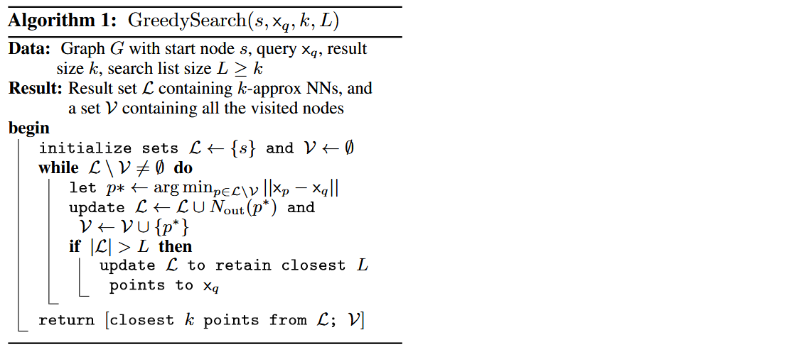
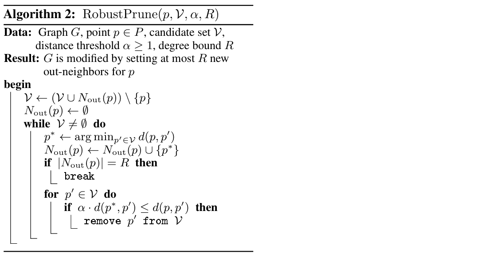
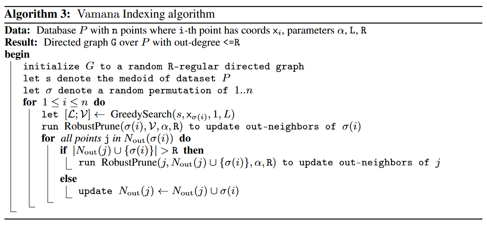
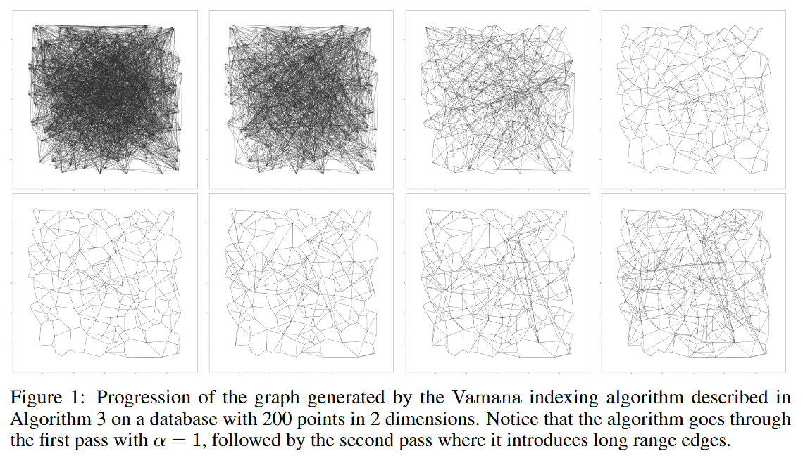
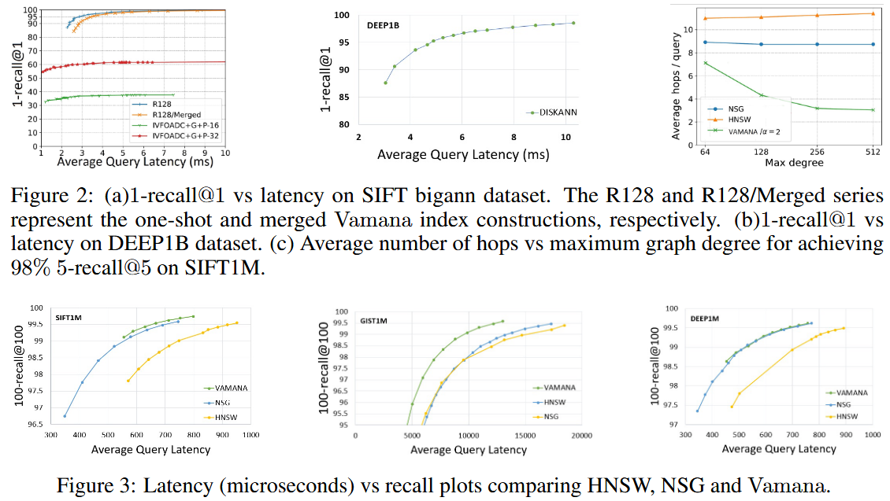
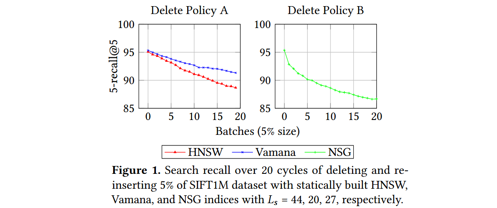
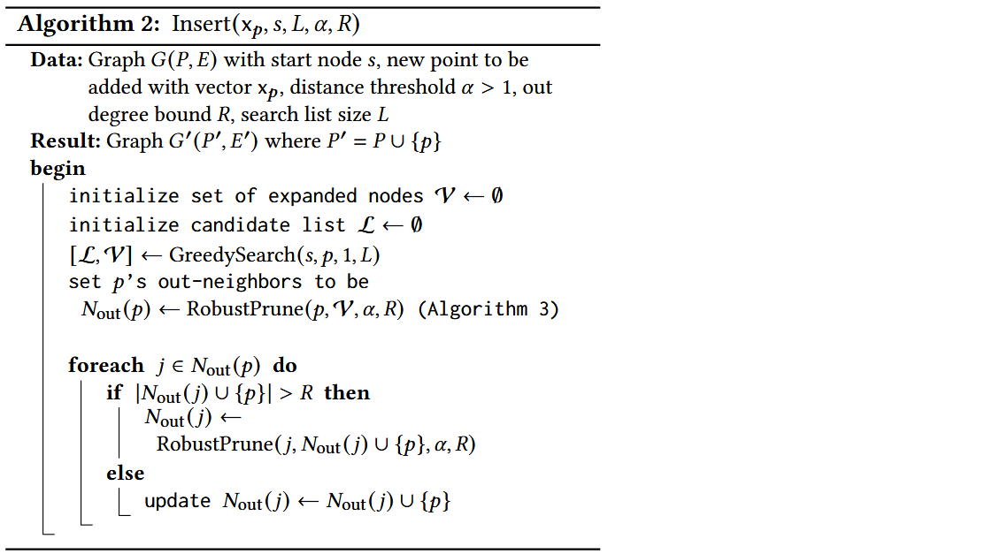
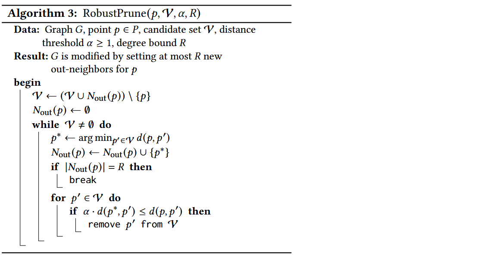
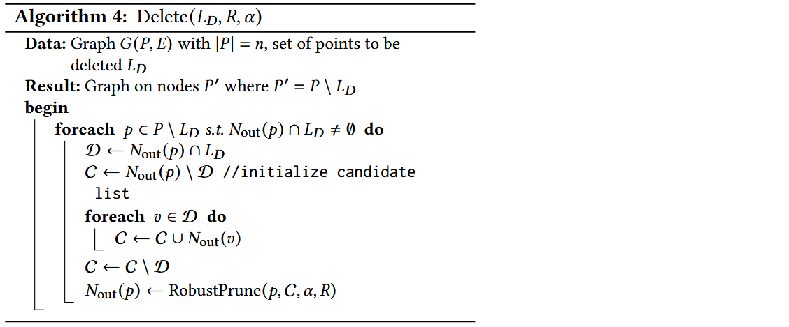

# DiskANN

全文字数: **{{ #word_count }}**

阅读时间: **{{ #reading_time }}**

---

## Background

DiskANN系列主要包含三篇论文：

- [DiskANN: Fast Accurate Billion-point Nearest Neighbor Search on a Single Node](https://papers.nips.cc/paper/9527-rand-nsg-fast-accurate-billion-point-nearest-neighbor-search-on-a-single-node.pdf)
- [FreshDiskANN: A Fast and Accurate Graph-Based  ANN Index for Streaming Similarity Search](https://arxiv.org/abs/2105.09613)
- [Filtered − DiskANN: Graph Algorithms for Approximate Nearest Neighbor Search with Filters](https://harsha-simhadri.org/pubs/Filtered-DiskANN23.pdf)

### SNG

## DiskANN: Fast Accurate Billion-point Nearest Neighbor Search on a Single Node

### Algorithm

#### GreedySearch

大多数基于图的近似最近邻搜索（ANN）算法的工作方式如下：在索引构建过程中，它们根据数据集 \( P \) 的几何属性构建图 \( G = (P, E) \)。在搜索时，对于查询向量 \( x_q \)，搜索采用自然的贪心或最优优先遍历，如算法1中的方式，在图 \( G \) 上进行。从某个指定的点 \( s \in P \) 开始，它们遍历图以逐步接近 \( x_q \)。

在SNG中，每个点 \( p \) 的外部邻居通过以下方式确定：初始化一个集合 \( S = P \setminus \{ p \} \)。只要 \( S \neq \emptyset \)，从 \( p \) 到 \( p^* \) 添加一条有向边，其中 \( p^* \) 是离 \( p \) 最近的点，从集合 \( S \) 中移除所有使得 \( d(p, p') > d(p^*, p') \)的点 \( p' \)。因此，贪心搜索（GreedySearch(s, \( x_p \), 1)）从任何 \( s \in P \) 开始都将收敛到 \( p \)，对于所有基点 \( p \in P \) 都成立。



#### RobustPrune

满足SNG性质的图都是适合贪心搜索搜索过程的良好候选图。然而，图的直径可能会相当大。例如，如果点在实数线的一维空间上线性排列，图的直径是 \( O(n) \)，其中每个点连接到两个邻居（一个在两端），这样的图满足SNG性质。搜索此类存储在磁盘上的图将导致在搜索路径中访问的顶点的邻居需要大量的顺序读取。

为了解决这个问题，希望确保查询距离在搜索路径的每个节点上按乘法因子 \( \alpha > 1 \) 递减，而不仅仅是像SNG性质那样递减。



#### Vamana Indexing

Vamana 以迭代的方式构建有向图 \( G \)。

1. 图 \( G \) 被初始化，使得每个顶点都有 \( R \) 个随机选择的外部邻居(在 \( R > \log n \) 时连接良好)。
2. 让 \( s \) 表示数据集 \( P \) 的中心点，它将作为搜索算法的起始节点。
3. 算法按随机顺序遍历 \( p \in P \) 的所有点，并在每一步更新图，使其更加适合贪心搜索（GreedySearch(s, \( x_p \), 1, L)）收敛到 \( p \)。

实际上，在对应点 \( p \) 的迭代中，

1. Vamana 在当前图 \( G \) 上运行 GreedySearch(s, \( x_p \), 1, L)，并将 \( V_p \) 设置为贪心搜索路径中所有访问过的点的集合。
2. 算法通过运行 RobustPrune(p, \( V_p \), \( \alpha \), \( R \)) 来更新图 \( G \)，以确定 \( p \) 的新外部邻居。
3. Vamana 更新图 \( G \)，通过为所有 \( p' \in N_{\text{out}}(p) \) 添加反向边（\( p', p \)）。这确保了在搜索路径和 \( p \) 之间的顶点连接，从而确保更新后的图会更适合贪心搜索（GreedySearch(s, \( x_p \), 1, L)）收敛到 \( p \)。
4. 添加这种形式的反向边（\( p', p \)）可能会导致 \( p' \) 的度数超过阈值，因此每当某个顶点 \( p' \) 的外度超过 \( R \) 的度数阈值时，图通过运行 RobustPrune(\( p' \), \( N_{\text{out}}(p') \), \( \alpha \), \( R \)) 来修改，其中 \( N_{\text{out}}(p') \) 是 \( p' \) 的现有外部邻居集合。

算法对数据集进行两次遍历，第一次遍历使用 \( \alpha = 1 \)，第二次使用用户定义的 \( \alpha \geq 1 \)。



```admonish question
为什么要分成两次遍历，不在一次中直接设定一个大于1的 \( \alpha \) 值完成图的构建？
```



### Design

#### Index Design

在数据集 \( P \) 上运行 Vamana，并将结果存储在 SSD 上。在搜索时，每当算法1需要某个点 \( p \) 的外部邻居时， 从 SSD 中获取该点的信息。

然而，单纯存储包含十亿个100维空间中的向量数据远超过工作站的RAM！这引出了两个问题：

1. 如何构建一个包含十亿个点的图？
2. 如果不能在内存中存储向量数据，如何在算法1的搜索时执行查询点与候选点之间的距离比较？

**问题一**

通过聚类技术（如k-means）将数据划分成多个较小的分片，为每个分片建立一个单独的索引，并仅在查询时将查询路由到几个分片。然而，这种方法会因为查询需要路由到多个分片而导致搜索延迟增加和吞吐量减少。

与其在查询时将查询路由到多个分片，不如将每个基础点发送到多个相邻的中心以获得重叠的聚类。事实上，我们将一个十亿点的数据集通过k-means划分为k个聚类（k=40，通常ℓ=2就足够），然后将每个基础点分配给ℓ个最近的中心。接着，我们为分配给每个聚类的点建立Vamana索引（这些点现在只有约Nℓ/k个点，可以在内存中建立索引），最后通过简单的边缘合并将所有不同的图合并为一个单一的图。

**问题二**

将每个数据库点 \( p \in P \) 的压缩向量 \( \tilde{x}_p \) 存储在主存中，同时将图存储在SSD上。使用Product Quantization将数据和查询点编码为短代码在查询时高效地计算近似距离 \( d(\tilde{x}_p, x_q) \)。尽管在搜索时只使用压缩数据，但是Vamana在构建图索引时使用的是“全精度坐标”，因此能够高效地引导搜索到图的正确区域，

#### Index Layout

将所有数据点的压缩向量存储在内存中，并将图以及全精度向量存储在SSD上。在磁盘中，对于每个点 \( i \)，我们存储其全精度向量 \( x_i \)，并跟随其\( \leq R \) 个邻居的标识。如果一个节点的度小于 \( R \)，我们用零填充，以便计算数据在磁盘中对应点 \( i \) 的偏移量变得简单，并且不需要在内存中存储偏移量。

#### Beam Search

运行算法1，按需从SSD获取邻居信息 \(N_{\text{out}}(p^*)\)。这需要很多次SSD的往返（每次往返仅需几百微秒），从而导致更高的延迟。为了减少往返SSD的次数（以便顺序地获取邻居），而不过多的增加计算量，一次性获取一个较小数量 \(W\)（例如4、8）最近的点的邻居，并将 \(\mathcal{L}\) 更新为这一小步中的前 \(L\) 个最优点。从SSD获取少量随机扇区的时间几乎与获取一个扇区的时间相同。

- 如果 \(W = 1\)，这种搜索类似于正常的贪婪搜索。
- 如果 \(W\) 太大，比如16或更多，则计算和SSD带宽可能会浪费。

#### Caching Frequently Visited Vertices

为了进一步减少每个查询的磁盘访问次数，缓存与一部分顶点相关的数据，这些顶点可以基于已知的查询分布来选择，或者通过缓存所有距离起始点 \( s \) 为 \( C = 3 \) 或 \( C = 4 \) 跳的顶点来选择。

由于索引图中与距离 \( C \) 相关的节点数量随着 \( C \) 增加呈指数增长，因此较大的 \( C \) 值会导致过大的内存占用。

#### Implicit Re-Ranking Using Full-Precision Vectors

由于PQ是一种有损压缩方法，因此使用基于PQ的近似距离计算出的与查询最接近的 \( k \) 个候选点之间存在差距。为了解决这个问题，使用存储在磁盘上与每个点相邻的全精度坐标。

事实上，在搜索过程中检索一个点的邻域时，也可以在不增加额外磁盘读取的情况下获取该点的全精度坐标。这是因为读取4KB对齐的磁盘地址到内存的成本不高于读取512B，而顶点的邻域（对于度为128的图，邻域大小为 \( 4 \times 128 \) 字节）和全精度坐标可以存储在同一磁盘扇区中。

因此，随着BeamSearch加载搜索前沿的邻域，它还会缓存在搜索过程中**访问的所有节点**的全精度坐标，而不需要额外的SSD读取操作。这使得我们能够基于全精度向量返回前 \( k \) 个候选点。

### Evaluation

(具体实验条件参见论文)

- 内存搜索性能比较
  - NSG和Vamana在所有情况下recall@100都优于HNSW
  - Vamana的索引构建时间优于HNSW和NSG
- 跳数（搜索中基于图的跳跃次数）比较
  - Vamana更适合用于基于SSD的搜索，其在大型数据集上比HNSW和NSG要快2到3倍。
  - 随着最大度数的增加，HNSW和NSG跳数出现了停滞趋势，而Vamana跳数有所减少，因为它能够增加更多的长距离边缘。推测Vamana在 \(\alpha > 1\) 时，比HNSW和NSG更好地利用了SSD提供的高带宽（在BeamSearch中，通过最大化𝑊来扩展搜索进行更大的磁盘读取）。
- One-Shot Vamana 和 Merged Vamana
  - Single：2 days, degree=113.9, peek memory usage=1100GB
  - Merged：5 days, degree=92.1, peek memory usage＜64GB
  - 单一索引优于合并索引，合并索引的延迟更高
  - 合并索引仍是十亿规模k-ANN索引和单节点服务的一个非常好的选择：相比单一索引，目标召回时只需增加不到20%的额外延迟



## FreshDiskANN: A Fast and Accurate Graph-Based  ANN Index for Streaming Similarity Search

### Introduction

在许多重要的现实场景中，用户与系统的交互会创建并销毁数据，并导致 \(P\) 的更新。针对这种应用的ANN系统需要能够托管包含数万亿个实时更新点的索引，这些更新可以反映数据集中的变化，理想情况下是实时进行的。

形式上定义 **fresh-ANNs** 问题如下：给定一个随时间变化的数据集 \(P\) （在时间 \(t\) 时的状态为 \(P_t\)），目标是维护一个动态索引，该索引计算任何查询 \(q\) 在时间 \(t\) 时，仅在活动数据集 \(P_t\) 上的近似最近邻。这样的系统必须支持三种操作：

- （a）插入新点，
- （b）删除现有点，以及
- （c）给定查询点进行最近邻搜索。
  
一个 **fresh-ANNs** 系统的总体质量由以下几个方面来衡量：

- 搜索查询的召回率与延迟之间的权衡，以及随着数据集 \(P\) 演变其对时间的鲁棒性。
- 插入和删除操作的吞吐量与延迟。
- 构建和维护此类索引所需的整体硬件成本（CPU、RAM 和 SSD 占用）。

freshDiskANN 注重于 **quiescent consistency** 的概念

```admonish quote
**quiescent consistency**: the results of search operations executed at any time t are  consistent with some total ordering of all insert and delete  operations completed before t.

quiescent consistency（静默一致性）是指在系统中执行的操作（如搜索、插入和删除）的结果，在某个时刻（如时间 𝑡）前的所有操作都已经完成，并且这些操作的结果与已执行的操作的顺序保持一致。如果一个查询需要依赖于之前的插入或删除操作，那么在查询时，插入和删除操作应已完成，并且查询结果应该基于这些已完成的操作。
```

**删除操作为什么难以实现？**

HNSW算法通过将删除的点添加到黑名单并将其从搜索结果中省略来处理删除请求，因为缺乏能够在保持原始搜索质量的同时修改可导航图的方法。考虑三种流行的静态ANNS算法，分别是HNSW、NSG和Vamana，并尝试了以下自然更新策略，看看在面对插入和删除操作时它们的表现。

- **插入策略。** 对于插入一个新点 \(p\)，运行相应算法使用的候选生成算法，并添加选定的入边和出边；如果任何顶点的度数超过预算，则运行相应的修剪过程。
- **删除策略A。** 当删除一个点 \(p\) 时，简单地删除与 \(p\) 相关的所有入边和出边，而不添加任何新边以弥补潜在的可导航性丧失。
- **删除策略B。** 当删除一个点 \(p\) 时，移除所有与 \(p\) 相关的入边和出边，并在 \(p\) 的局部邻域中添加边：对于图中的每对有向边 \((p_{in}, p)\) 和 \((p, p_{out})\)，在更新的图中添加边 \((p_{in}, p_{out})\)。如果任何顶点的度数超过限制，则运行相应算法的修剪过程来控制度数。



一个稳定的更新策略应该在每个周期之后产生相似的搜索性能，因为索引是建立在相同的数据集上的。然而，所有算法都表现出搜索性能持续下降的趋势。

**FreshVamana**

随着图的更新，图变得稀疏（平均度数较小），因此变得不那么可导航。怀疑这是由于现有算法（如HNSW和NSG）使用非常激进的修剪策略来偏向稀疏图所导致的。

**α-RNG Property.** DiskANN中构建的图的关键思想是采用更为宽松的剪枝过程，它仅在存在一条边 \((p, p')\) 且 \(p'\) 必须比 \(p\) 更接近 \(p''\) 时才移除边 \( (p, p') \)，即 \(d(p', p'') < \frac{d(p, p'')}{\alpha}\)，其中 \(\alpha > 1\)。使用 \(\alpha > 1\) 生成这样的图直观地确保了查询向量到目标向量的距离在算法 1 中以几何方式逐步减小，因为只移除那些存在绕道边，使得s'yu显著朝目标方向推进的边。因此，随着 \(\alpha\) 的增加，图变得更加密集。**利用α-RNG属性，确保图的持续可导航性，并保持多个插入和删除操作过程中的稳定召回率。**

### Algorithms

GreedySearch 与 DiskANN中的算法1相同

#### Index Build

构建一个可导航图。图的构建通常有两个对立的目标，以最小化搜索复杂度：

1. 使应用到每个基点 \(p \in P\) 上的贪心搜索算法在最少的迭代中收敛到 \(p\)
2. 使所有 \(p \in P\) 的最大出度 \(R\) 不超过 \(R\)

```admonish quote
NN-Descent使用梯度下降来确定图G。其他方法从特定类型的图开始，例如没有边的空图或一个近似的 \(k\)-NN图
```

从初始图开始，经过以下两步构建算法逐步精炼G，以提高可导航性。

1. **生成候选** ： 对于每个基点 \(x_p\)，在图 \(G\) 上运行算法1（从固定的起始点s开始）来获得 \(\mathcal{V}, \mathcal{L}\)，其中 \( \mathcal{L}\) 包含最接近 \(p\) 的节点，将它们添加到 \(Nout(p)\) 和 \(Nin(p)\) 的良好候选，从而提高更新图G中对 \(p\) 的可导航性。
2. **边修剪** ： 当节点 \(p\) 的出度超过 \(R\) 时，修剪算法（如算法3，\(\alpha = 1\)）会从邻接列表中过滤出类似的（或冗余的）边，以确保 \(|Nout(p)| \leq R\)。过程会按距离 \(p\) 的增大顺序对其邻居进行排序，如果算法1能够通过 \(p'\) 从 \(p\) 到达 \(p''\)，则可以安全地移除边 \((p, p')\)）。

#### Insertion

新的点 \(x_p\) 被插入到 FreshVamana 索引中，使用算法 2。它查询当前索引中的点 \(p\) 的最近邻，以获取访问集 \(V\)。



通过在 \(V\) 上使用算法 3 的剪枝过程生成 \(x_p\) 的候选外部邻居，并在 \(p\) 和剪枝后的候选之间添加双向边。如果任何顶点的出度超过 \(R\)，则可以使用算法 3 将其剪枝至 \(R\)。



使用基于锁的并发控制来保护对节点 \(p\) 的 \(N_{out}(p)\) 的访问，从而允许通过多个线程进行高效插入。由于锁的粒度较细，并且锁保持的时间较短，因此插入吞吐量在多线程下接近线性扩展。

#### Deletion

删除算法算法 4 参考了上文中的 **删除策略B**，关键特性是使用宽松的 \(\alpha\)-剪枝算法来保持修改后图的稠密性。具体而言，如果删除点 \(p\)，则在图中添加边 \( (p', p'') \)，其中 \( (p', p) \) 和 \( (p, p'') \) 是有向边。在此过程中，如果 \( |N_{out}(p')| \) 超过最大出度 \(R\)，我们使用算法 3 对其进行剪枝，以保持 \(\alpha\)-RNG 性质。

然而，由于该操作涉及编辑 \(p\) 的所有入邻居的邻域，代价可能很大，无法在删除到达时立即处理。FreshVamana 采用了懒删除策略 —— 当一个点 \(p\) 被删除时，我们将 \(p\) 添加到 DeleteList 中而不改变图。DeleteList 包含所有已删除但仍存在于图中的点。在搜索时，修改后的算法 1 使用 DeleteList 中的节点进行导航，但会从结果集中筛选掉它们。

**删除合并**。在累积了大量删除操作（例如，索引大小的 1%-10%）后，使用算法 4 批量更新图，以更新有外边的点的邻域，从而将这些删除的节点更新到图中。此操作可以通过前缀和操作来并行化，并通过并行映射操作来本地更新删除节点周围的图。




## Summary

### Comparison of Vamana with HNSW and NSG

Vamana 与 HNSW 和 NSG 非常相似。这三种算法都在数据集 \( P \) 上进行迭代，并使用 GreedySearch(s, \( x_p \), 1, L) 和 RobustPrune(p, \( V \), \( \alpha \), \( R \)) 的结果来确定 \( p \) 的邻居。这些算法之间存在一些重要的差异。

- 最关键的是，HNSW 和 NSG 都没有可调参数 \( \alpha \)，而且隐式使用 \( \alpha = 1 \)。(这是使 Vamana 在图的度数和直径之间实现更好折衷的主要因素)
- 虽然 HNSW 将候选集 \( V \) 设置为贪心搜索（GreedySearch(s, \( p \), 1, L)）的修剪过程的最终候选结果集，Vamana 和 NSG 将 \( V \) 设置为贪心搜索（GreedySearch(s, \( p \), 1, L)）访问的所有顶点的集合。从直觉上讲，这个特征有助于 Vamana 和 NSG 添加长距离边，而 HNSW 仅通过添加局部边来构建图的层次结构，进而构建嵌套的图序列。
- NSG 将数据集上的图初始化为近似 \( K \)-最近邻图，这是一个时间和内存密集型的步骤，而 HNSW 和 Vamana 则有更简单的初始化过程，前者从一个空图开始，Vamana 从一个随机图开始。
- Vamana 进行两次遍历数据集，而 HNSW 和 NSG 只进行一次遍历，动机是基于我们观察到的第二次遍历能提高图的质量。

> - [DiskANN: Fast Accurate Billion-point Nearest Neighbor Search on a Single Node](https://papers.nips.cc/paper/9527-rand-nsg-fast-accurate-billion-point-nearest-neighbor-search-on-a-single-node.pdf)
> - [FreshDiskANN: A Fast and Accurate Graph-Based  ANN Index for Streaming Similarity Search](https://arxiv.org/abs/2105.09613)
> - [Filtered − DiskANN: Graph Algorithms for Approximate Nearest Neighbor Search with Filters](https://harsha-simhadri.org/pubs/Filtered-DiskANN23.pdf)
