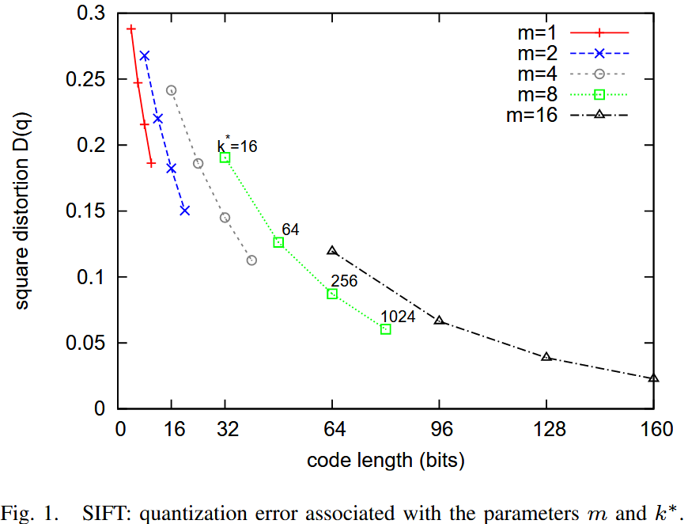
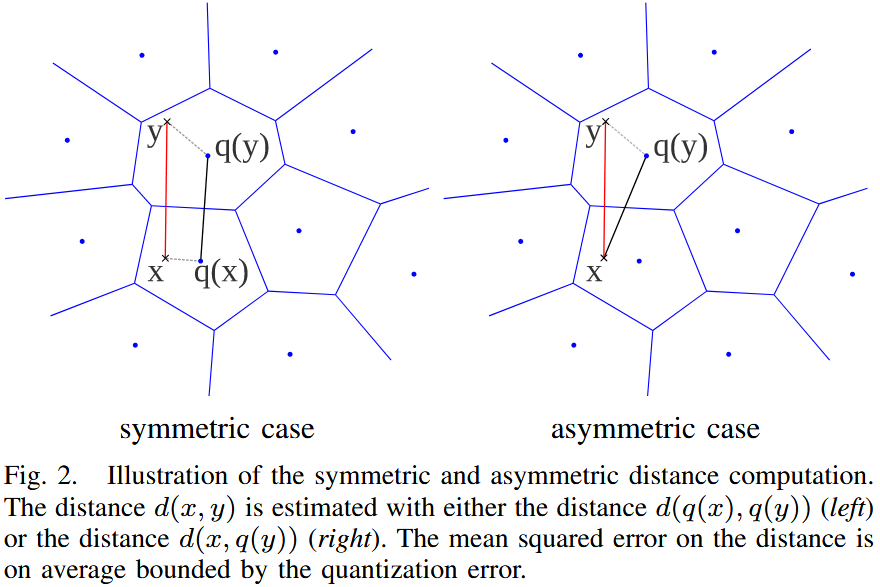
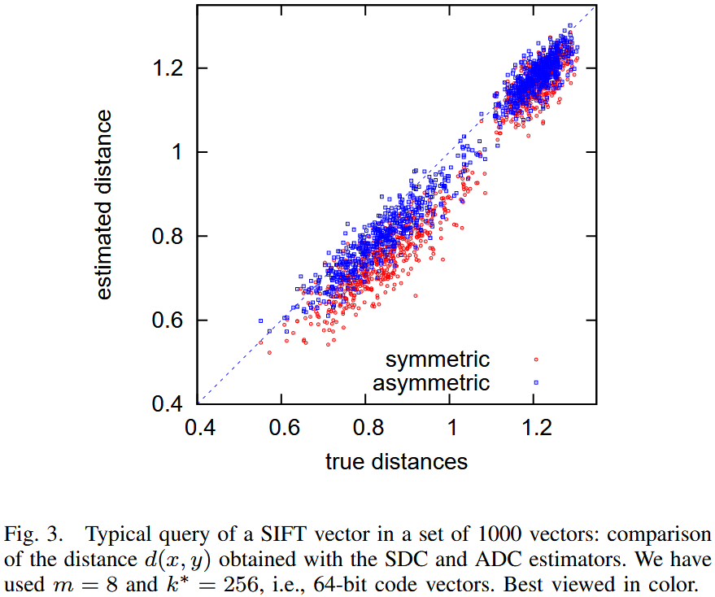
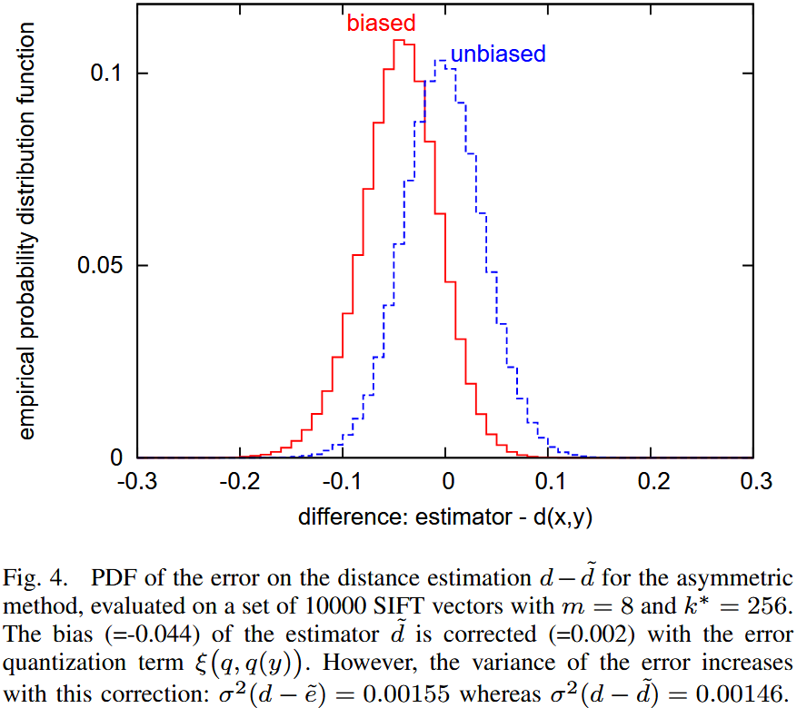
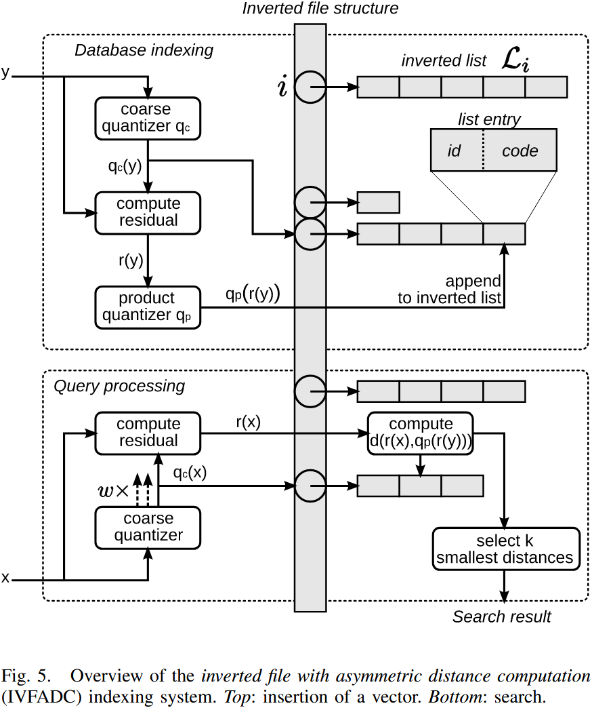

# Product Quantization for Nearest Neighbor Search
<!-- 
## Pretrain

- Clustering：

    以128维向量为例，首先指定一个参数M（例如4），表示将向量切分成M段。这样N个向量都被切成了4段的32维向量，以第一段的N个32维向量为例，做 Clustering 得到K个簇心（例如256，经验值）。
- Assign：

    把每一段的向量分配到最近的簇心，得到一个4维的索引，例如[0, 255, 78, 183]。

这样就完成了向量的压缩。

## Query

对于每一个查询向量，以相同的方法把128维分成4段32维向量，然后计算每一段向量与之前预训练好的簇心的距离，得到一个4*256的表。

所以在计算时只用查M次表，比如的库里的某个向量被量化成了[0, 255, 78, 183], 那么首先查表得到查询向量第一段子向量与其ID为0的簇心的距离，然后再查表得到查询向量第二段子向量与其ID为255的簇心的距离......最后就可以得到四个距离d1、d2、d3、d4，查询向量跟库里向量的距离d = d1+d2+d3+d4。 -->

全文字数: **{{ #word_count }}**

阅读时间: **{{ #reading_time }}**

## Notations

### Vector quantization

量化是一种破坏性（destructive）过程，其目的是减少表示空间的基数。形式上，一个**量化器（quantizer）** 是一个函数 \(q\)，它将一个 \(D\) 维向量 \(x \in \mathbb{R}^D\) 映射到一个向量 \(q(x) \in \mathcal{C} = \{c_i; i \in \mathcal{I}\}\)，其中索引集合 \(\mathcal{I}\) 现在假设是有限的，即 \(\mathcal{I} = 0 \dots k-1\)。**再现值（reproduction values）** \(c_i\) 被称为**质心（centroids）** 。再现值的集合 \(\mathcal{C}\) 被称为**码本（codebook）** ，其大小为 \(k\)。

映射到给定索引 \( i \) 的向量集合 \( \mathcal{V}_i \) 被称为 **（Voronoi）单元（cell）**，定义如下：
\[
\mathcal{V}_i \triangleq \{ x \in \mathbb{R}^D : q(x) = c_i \}.
\]
量化器的 \( k \) 个单元构成了 \( \mathbb{R}^D \) 的一个划分。根据定义，所有位于同一单元 \( \mathcal{V}_i \) 内的向量都由同一个质心 \( c_i \) 重构。量化器的质量通常通过输入向量 \( x \) 与其重构值 \( q(x) \) 之间的**均方误差（MSE, Mean Squared Error）** 来衡量：
\[
\text{MSE}(q) = \mathbb{E}_X \left[ d(q(x), x)^2 \right] = \int p(x) d(q(x), x)^2 dx,
\]

- \( d(x, y) = \| x - y \| \) 表示 \( x \) 和 \( y \) 之间的欧几里得距离
- \( p(x) \) 是对应于随机变量 \( X \) 的概率分布函数。

对于任意概率分布函数，通常使用**蒙特卡洛采样（Monte-Carlo sampling）** 进行数值计算，即在大量样本上计算 \( \| q(x) - x \|^2 \) 的平均值。

为了使量化器达到最优，它必须满足**Lloyd 最优条件（Lloyd optimality conditions）** 中的两个性质。

1. 向量 \( x \) 必须被量化为最近的码本质心，即在欧几里得距离意义下：
\[
q(x) = \arg \min_{c_i \in \mathcal{C}} d(x, c_i).
\]
因此，单元（cells）由**超平面（hyperplanes）** 划定。
1. 重构值必须是 Voronoi 单元内向量的期望值，即：
\[
c_i = \mathbb{E}_X [x \mid i] = \int_{\mathcal{V}_i} p(x \mid x \in \mathcal{V}_i) x \, dx.
\]

**Lloyd 量化器（Lloyd quantizer）** 对应于 k-means 聚类算法，它通过迭代的方式寻找近似最优的码本，不断地将训练集中向量分配给质心，并从这些分配的向量中重新估计质心。需要注意的是，k-means 只能找到局部最优解，而非全局最优解（就量化误差而言）。

**均方畸变（mean squared distortion）**  \( \xi(q, c_i) \)，描述了当一个向量被重构到所属单元 \( \mathcal{V}_i \) 的质心 \( c_i \) 时的误差。令：
\[
p_i = \mathbb{P}(q(x) = c_i)
\]
表示一个向量被分配到质心 \( c_i \) 的概率，则该误差的计算公式如下：
\[
\xi(q, c_i) = \frac{1}{p_i} \int_{\mathcal{V}_i} d(x, q(x))^2 p(x) \, dx.
\]
均方误差（MSE）可以由这些量计算得到：
\[
\text{MSE}(q) = \sum_{i \in \mathcal{I}} p_i \, \xi(q, c_i).
\]

### Product quantizers

**乘积量化（Product quantization）** 输入向量 \( x \) 被划分为 \( m \) 个不同的子向量 \( u_j \)，其中 \( 1 \leq j \leq m \)，每个子向量的维度为：

\[
D^* = D / m
\]

其中 \( D \) 是 \( m \) 的整数倍。这些子向量分别使用 \( m \) 个不同的量化器进行量化。因此，给定的向量 \( x \) 被映射如下：

\[
\underbrace{x_1, ..., x_{D^*}}_{u_1(x)}, ..., \underbrace{x_{D-D^*+1}, ..., x_D}_{u_m(x)} \rightarrow q_1(u_1(x)), ..., q_m(u_m(x)),
\]

其中 \( q_j \) 是与第 \( j \) 个子向量相关的低复杂度量化器。对于子量化器 \( q_j \)，关联索引集合 \( \mathcal{I}_j \)、码本 \( \mathcal{C}_j \) 以及对应的重构值 \( c_{j,i} \)。

乘积量化器的重构值由 乘积索引集合 的一个元素唯一标识：

\[
\mathcal{I} = \mathcal{I}_1 \times ... \times \mathcal{I}_m
\]

因此，码本定义为笛卡尔积：

\[
\mathcal{C} = \mathcal{C}_1 \times ... \times \mathcal{C}_m
\]

该集合的质心是 \( m \) 个子量化器的质心的串联。假设所有的子量化器都有相同的有限重构值数量 \( k^* \)，因此，总质心数为：

\[
k = (k^*)^m
\]

在极端情况下（当 \( m = D \)），向量 \( x \) 的每个分量都会被单独量化，此时 乘积量化器退化为标量量化器，其中每个分量的量化函数可能不同。

乘积量化器的优势在于可以通过多个小型质心集（子量化器的质心集合）来生成大规模质心集合。当使用 Lloyd 算法学习子量化器时，使用的样本数量有限，但码本仍然可以适应数据分布。

乘积量化器的学习复杂度是 \( m \) 倍于在 \( D^* \) 维度上进行 \( k^* \) 质心的 k-means 聚类的复杂度。

显式存储码本 \( \mathcal{C} \) 并不高效，因此只存储所有子量化器的 \( m \times k^* \) 个质心，即：

\[
m D^* k^* = k^* D
\]

个浮点值。量化一个元素需要 \( k^* D \) 次浮点运算。下表总结了 k-means、HKM 和乘积 k-means 的计算资源需求。乘积量化器 是唯一能在大 \( k \) 值时被索引存储于内存的方法。

| Method            | Memory Usage                                  | Assignment Complexity          |
|------------------|--------------------------------------------|------------------------------|
| k-means         | \( kD \)                                   | \( kD \)                     |
| HKM            | \( \frac{b_f}{b_f - 1} (k - 1) D \)        | \( lD \)                     |
| Product k-means | \( m k^* D^* = k^{1/m} D \)                | \( m k^* D^* = k^{1/m} D \)   |

为了保证良好的量化性能，在 \( k^* \) 取常数时，每个子向量应具有相近的能量。一种方法是在量化前用随机正交矩阵变换向量，但对于大多数向量类型来说，这并不需要，也不推荐，因为相邻分量通常由于构造上的相关性而更适合使用相同的子量化器量化。

由于子空间正交，乘积量化器的**平方畸变（Squared Distortion）** 可计算为：

\[
\text{MSE}(q) = \sum_j \text{MSE}(q_j)
\]

其中 \( \text{MSE}(q_j) \) 是与子量化器 \( q_j \) 相关的畸变。

下图  显示了 MSE 随代码长度变化的曲线，其中代码长度为：
\(
l = m \log_2 k^*
\),\(k^*\)是2的幂

可以观察到，在给定比特数的情况下，使用少量子量化器，但每个子量化器有更多质心，比使用多个子量化器但每个子量化器比特数较少要更好。

在极端情况下（当 \( m = 1 \)），乘积量化器退化为标准 k-means 码本。

高 \( k^* \) 值 会增加量化器的计算成本（如表 I 所示），同时也增加了存储质心的内存开销（即 \( k^* \times D \) 个浮点数）。如果质心查找表无法适应缓存，则效率会降低。

在 \( m = 1 \) 的情况下，为了保证计算开销可控，无法使用超过 16 位的编码。通常，选择 \( k^* = 256 \) 且 \( m = 8 \) 是一个合理的选择。

## Search

### Computing distances using quantized codes

假设有一个查询向量 \( x \) 和一个数据库向量 \( y \)。有两种方法来计算这些向量之间的**近似欧几里得距离**：**对称距离计算（SDC）** 和 **非对称距离计算（ADC）**。

**对称距离计算（Symmetric Distance Computation, SDC）：**  

在 SDC 方法中，查询向量 \( x \) 和数据库向量 \( y \) 均由其对应的质心 \( q(x) \) 和 \( q(y) \) 表示。因此，距离 \( d(x, y) \) 近似为：

\[
\hat{d}(x, y) \triangleq d(q(x), q(y))
\]

利用 乘积量化器，这个距离可以高效地计算为：

\[
\hat{d}(x, y) = d(q(x), q(y)) = \sqrt{\sum_j d(q_j(x), q_j(y))^2}
\]

其中，距离项 \( d(c_{j,i}, c_{j,i'})^2 \) 从查找表中读取，该查找表与第 \( j \) 个子量化器相关。每个查找表包含所有质心对 \((i, i')\) 之间的平方距离，即存储了 \( (k^*)^2 \) 个平方距离。

**非对称距离计算（Asymmetric Distance Computation, ADC）：**  

在 ADC 方法中，数据库向量 \( y \) 仍由其质心 \( q(y) \) 表示，但查询向量 \( x \) 不经过编码。因此，距离 \( d(x, y) \) 近似为：

\[
\tilde{d}(x, y) \triangleq d(x, q(y))
\]

其计算方式如下：

\[
\tilde{d}(x, y) = d(x, q(y)) = \sqrt{\sum_j d(u_j(x), q_j(u_j(y)))^2}
\]

其中，平方距离 \( d(u_j(x), c_{j,i})^2 \) 在搜索之前已经计算，其中 \( j = 1, ..., m \)，\( i = 1, ..., k^* \)。

在最近邻搜索中，实际上不会计算平方根，直接使用平方距离进行排序。

下表  总结了在数据集中搜索最近邻所涉及的不同步骤的复杂度。假设数据集 \( \mathcal{Y} \) 的大小为 \( n = |\mathcal{Y}| \)，可以看到 SDC 和 ADC 的查询准备成本是相同的，并且不依赖于数据集大小 \( n \)。

|                         | SDC          | ADC                     |
|-------------------------|-------------|-------------------------|
| Encoding \( x \)        | \( k^* D \)  | \( 0 \)                 |
| Compute \( d(u_j(x), c_{j,i}) \) | \( 0 \) | \( k^* D \)           |
| Compute \( \hat{d}(x, y) \) or \( \tilde{d}(x, y) \) | \( n m \) | \( n m \) |
| Find \(top-k\)| \( n + k \log k \log \log n \) | \( n + k \log k \log \log n \) |

当 \( n \) 很大（\( n > k^* D^* \)）时，计算量主要由求和运算决定。而搜索 \( k \) 个最小元素的复杂度 是对 \( n \gg k \) 的元素进行无序比较的平均复杂度。

**SDC 与 ADC 的对比**  

| |Pros|Cons|
|---|---|---|
|**SDC**|减少查询向量的内存开销|更高的距离畸变|
|**ADC**|更低的距离畸变|相对较高的查询向量内存开销|

在本文的剩余部分，将重点讨论 **ADC 方法**。

### Analysis of the distance error

分析使用 \( \tilde{d}(x, y) \) 代替 \( d(x, y) \) 所带来的距离误差。这一分析不依赖于乘积量化器，对满足 Lloyd 最优条件的任何量化器都适用。

在重构的均方误差（MSE）准则的基础上，距离畸变（distance distortion） 通过均方距离误差（MSDE） 来衡量：

\[
\text{MSDE}(q) \triangleq \iint (d(x, y) - \tilde{d}(x, y))^2 p(x) dx \, p(y) dy. 
\]

根据三角不等式有：

\[
d(x, q(y)) - d(y, q(y)) \leq d(x, y) \leq d(x, q(y)) + d(y, q(y)).
\]

同样地，可以写成：

\[
(d(x, y) - d(x, q(y)))^2 \leq d(y, q(y))^2.
\]

可得：

\[
\text{MSDE}(q) \leq \int p(x) \left( \int d(y, q(y))^2 p(y) dy \right) dx.
\]

最终得到：

\[
\text{MSDE}(q) \leq \text{MSE}(q).
\]

其中，\( \text{MSE}(q) \) 是与量化器 \( q \) 相关的均方误差。

该不等式适用于任何量化器，表明本方法的距离误差在统计意义上受量化器的 MSE 约束。

对于 对称版本（SDC），类似的推导表明其误差在统计上受 \( 2 \times \text{MSE}(q) \) 约束。因此，最小化量化误差（MSE）是重要的，因为它可以作为距离误差的统计上界。

如果在最高排名的向量上执行精确距离计算（如 局部敏感哈希（LSH）），那么量化误差可以用作动态选择需要后处理的向量集合的标准，而不是随意选择某一部分向量。

### Estimator of the squared distance

分析使用 \( \hat{d}(x, y) \) 或 \( \tilde{d}(x, y) \) 进行估算时，如何在平均意义上低估描述符之间的距离。

该图显示了在 1000 个 SIFT 向量数据集中查询一个 SIFT 描述符所得的距离估计。该图比较了真实距离与SDC与ADC计算出的估计值。可以清楚地看到，这些距离估计方法存在偏差（bias），且对称版本（SDC）更容易受到偏差的影响。

为了消除偏差，计算平方距离的期望值。在乘积量化方法中，一个给定向量 \( y \) 的近似值 \( q(y) \) 由其子量化索引 \( q_j(u_j(y)) \)（其中 \( j = 1, ..., m \)）获得。

量化索引标识了向量 \( y \) 所处的单元 \( \mathcal{V}_i \)。因此，可以计算期望平方距离 \( \tilde{e}(x, q(y)) \) 作为修正项：

\[
\tilde{e}(x, y) \triangleq \mathbb{E}_Y [(x - Y)^2 \mid q(Y) = c_i]
\]

\[
= \int_{\mathcal{V}_i} (x - y)^2 p(y \mid i) dy
\]

\[
= \frac{1}{p_i} \int_{\mathcal{V}_i} (x - c_i + c_i - y)^2 p(y) dy.
\]

根据Lloyd 最优条件有：

\[
\int_{\mathcal{V}_i} (y - c_i) p(y) dy = 0.
\]

因此可简化为：

\[
\tilde{e}(x, y) = (x - q(y))^2 + \int_{\mathcal{V}_i} (q(y) - y)^2 p(y \mid y \in \mathcal{V}_i) dy.
\]

\[
= \tilde{d}(x, y)^2 + \xi(q, q(y)).
\]

其中，\( \xi(q, q(y)) \) 代表了重构误差（distortion），即 \( y \) 由其重构值 \( q(y) \) 近似时的误差。

在乘积量化框架下，向量 \( x \) 与 \( y \) 之间的期望平方距离可以通过修正方程 (13) 计算：

\[
\tilde{e}(x, y) = \tilde{d}(x, y)^2 + \sum_j \xi_j(y).
\]

其中，修正项 \( \xi_j(y) \) 为第 \( j \) 个子量化器的平均畸变（distortion）：

\[
\xi_j(y) \triangleq \xi(q_j, q_j(u_j(y))).
\]

这些畸变值可以预先学习，并存储在查找表中，供量化索引 \( \mathcal{I}_j \) 使用。

对于 对称版本（SDC），即 \( x \) 和 \( y \) 均经过量化，类似的推导可以得到修正后的平方距离估计公式：

\[
\hat{e}(x, y) = \hat{d}(x, y)^2 + \sum_j \xi_j(x) + \sum_{j'} \xi_{j'}(y).
\]

**Discussion**
该图显示了真实距离与估计距离之间的概率分布。该实验基于大规模 SIFT 描述符数据集。

- 进行距离估计时，存在明显偏差。
- 采用 修正版本（，距离估计的偏差显著减少。

然而，修正偏差 会导致估计方差增大，这在统计学上是一个常见现象。此外，对于最近邻搜索而言：

- 修正项往往估计值更大，这可能会惩罚具有罕见索引的向量。
- 在 非对称版本（ADC） 中，修正项与查询 \( x \) 无关，只依赖于数据库向量 \( y \)。

在实验中，修正方法在整体上效果较差，因此建议在最近邻搜索任务中使用原始版本，而修正版本仅在需要精准距离估计的任务中适用。

## Avoid exhaustive search

使用乘积量化器进行近似最近邻搜索非常高效（每次距离计算仅需 \( m \) 次加法运算），并且大大减少了存储描述符所需的内存。然而，标准搜索方法是穷举式（Exhaustive）的。

为了避免穷举搜索：

- 倒排文件系统（Inverted File System, IVF）
- 非对称距离计算（ADC）  

该方法称为 IVFADC。

传统倒排文件仅存储图像索引，而本文在此基础上增加了额外的编码，以便对每个描述符进行更精细的存储。使用乘积量化器对向量与其对应的粗质心之间的残差进行编码。  

- 显著加速搜索过程，代价仅是每个描述符存储额外的少量比特/字节。
- 提高搜索精度，因为对残差进行编码比直接编码向量本身更加精确。

### Coarse quantizer, locally defined product quantizer

码本（codebook）是通过 k-means 学习得到的，并生成了一个量化器 \( q_c \)，在后续内容中称为 粗量化器（coarse quantizer）。对于 SIFT 描述符，与 \( q_c \) 相关的质心（centroid）数量 \( k' \) 通常在 1000 到 1000000 之间。因此，与 乘积量化器相比，粗量化器的规模较小。

除了粗量化器，还使用乘积量化器对向量的描述进行细化。具体来说，粗量化器 \( q_c(y) \) 生成的质心可以提供全局信息，但仍需进一步编码残差信息，因此使用 乘积量化器 \( q_p \) 对残差向量进行编码：

\[
r(y) = y - q_c(y),
\]

其中，残差向量 \( r(y) \) 表示 Voronoi 单元中的偏移量。由于残差向量的能量相比原始向量要小，因此存储其量化信息的代价也较低。

向量 \( y \) 可被近似表示为：

\[
\ddot{y} \triangleq q_c(y) + q_p(y - q_c(y)).
\]

它可以用元组 \((q_c(y), q_p(r(y)))\) 来表示。

类比于二进制表示的概念：

- 粗量化器（\( q_c \)） 提供的是最高有效位（MSB），用于大致定位向量。
- 乘积量化器（\( q_p \)） 提供的是最低有效位（LSB），用于精细校正残差信息。

查询向量 \( x \) 和数据库向量 \( y \) 之间的距离可以近似计算为 \( \ddot{d}(x, y) \)：

\[
\ddot{d}(x, y) = d(x, \ddot{y}) = d\Big(x - q_c(y), q_p(y - q_c(y))\Big).
\]

令 \( q_{p_j} \) 表示第 \( j \) 个子量化器（Subquantizer），则可分解计算该距离：

\[
\ddot{d}(x, y)^2 = \sum_j d\Big(u_j(x - q_c(y)), q_{p_j}(u_j(y - q_c(y)))\Big)^2.
\]

类似于 ADC（Asymmetric Distance Computation） 策略，对于每个子量化器 \( q_{p_j} \)，预计算部分残差向量 \( u_j(x - q_c(y)) \) 与所有质心 \( c_{j,i} \) 之间的距离，并存储这些值。

乘积量化器是在一个学习集合中通过残差向量训练得到的。虽然向量最初由粗量化器映射到不同的索引，但最终的残差向量被用于训练一个统一的乘积量化器。

假设当残差在所有 Voronoi 单元上进行边际化（Marginalization）时，相同的乘积量化器仍然有效。然而，这种方法的效果可能不如为每个 Voronoi 单元单独训练一个独立的乘积量化器，但后者的计算成本极高。如果要为每个 Voronoi 单元分别训练乘积量化器，则需要存储 \( k' \) 个乘积量化码本，即：

\[
k' \times d \times k^*
\]

个浮点值。这对于典型的 \( k' \) 值来说，将会导致极高的存储需求，在实际应用中难以承受。

### Indexing structure

使用粗量化器（coarse quantizer）来实现一种倒排文件结构（inverted file structure），它被组织成一个包含列表的数组 \(\mathcal{L}_1 \dots \mathcal{L}_{k'}\)。如果 \(\mathcal{Y}\) 是要索引的向量数据集，那么与质心 \(c_i\) 相关联的列表 \(\mathcal{L}_i\) 将存储集合 \(\{y \in \mathcal{Y} : q_c(y) = c_i\}\)。

在倒排列表 \(\mathcal{L}_i\) 中，与 \(y\) 相关的条目包含一个向量标识符（vector identifier）和编码后的残差 \(q_p(r(y))\)：

| field       | length(bits) |
|------------|------------|
| identifier | 8–32       |
| code        | \(m \lfloor \log_2 k^* \rfloor\) |

标识符字段是倒排文件结构带来的开销。根据存储向量的不同特性，标识符不一定是唯一的。例如，在使用局部描述符（local descriptors）表示图像时，图像标识符可以替代向量标识符，即同一张图像的所有向量都可以使用相同的标识符。因此，20 位的标识符字段足以在一个包含一百万张图像的数据集中唯一标识一张图像。

通过索引压缩（index compression）可以进一步降低存储开销，使存储标识符的平均成本降低到约 8 比特，具体取决于参数。

### Search algorithm

倒排文件（inverted file）是非穷尽（non-exhaustive）的关键。当搜索向量 \(x\) 的最近邻时，倒排文件提供了一个 \(\mathcal{Y}\) 的子集，用于计算距离：仅扫描与 \(q_c(x)\) 对应的倒排列表 \(\mathcal{L}_i\)。

然而，\(x\) 及其最近邻通常不会被量化到同一个质心，而是被量化到相邻的质心。为了解决这个问题，采用 多重分配（multiple assignment） 策略 。查询向量 \(x\) 被分配到 \(w\) 个索引，而不是仅仅一个索引，这些索引对应于 代码本 \(q_c\) 中 \(x\) 的 \(w\) 个最近邻。然后，扫描所有相应的倒排列表。多重分配不会用于数据库向量，因为这会增加内存占用。

下图概述了数据库的索引和搜索过程。

**索引（Indexing）向量 \(y\) 的过程如下：**

1) 对 \(y\) 进行量化，得到 \(q_c(y)\)；
2) 计算残差（residual）：\(r(y) = y - q_c(y)\)；
3) 对残差 \(r(y)\) 进行量化，得到 \(q_p(r(y))\)，对于乘积量化器（product quantizer），这意味着将 \(u_j(y)\) 映射到 \(q_j(u_j(y))\)，其中 \(j = 1 \dots m\)；
4) 向倒排列表 \(\mathcal{L}_{q_c(y)}\) 添加新条目，该条目包含 向量（或图像）标识符 和 二进制编码（即乘积量化器的索引）。

**查询（Searching）最近邻 \(x\) 的过程如下：**

1) 将 \(x\) 量化到代码本 \(q_c\) 中最近的 \(w\) 个质心；

   为了便于表述，接下来的两步中简单地用 \(r(x)\) 来表示与这些 \(w\) 个分配相关的残差。这两个步骤适用于所有 \(w\) 个分配。

2) 计算平方距离 \(d(u_j(r(x)), c_{j,i})^2\)，对于每个子量化器 \(j\) 以及其所有质心 \(c_{j,i}\)；

3) 计算 \(r(x)\) 与倒排列表中所有索引向量的平方距离；

   使用上一步计算的子向量到质心距离，最终得到总距离。这一过程涉及查找 \(m\) 个预计算值（见公式 31）。

4) 根据估计距离选择 \(K\) 个最近邻：

   - 这一过程使用 最大堆（Maxheap） 结构（固定容量）来存储 当前已找到的 \(K\) 个最小距离；
   - 每次计算距离后，仅当该点的距离小于最大堆中当前的最大距离时，才将其插入数据结构。

只有第 3 步 依赖于数据库的大小。与 ADC（Asymmetric Distance Computation，非对称距离计算） 相比，额外的 量化 \(x\) 到 \(q_c(x)\) 仅涉及计算 \(k'\) 个 D 维向量的距离。假设倒排列表是均衡的，则需要解析 \(n \times w / k'\) 个条目。因此，该搜索方法比 ADC 显著更快。

---

> [Product Quantization for Nearest Neighbor Search](https://inria.hal.science/inria-00514462/file/jegou_pq_postprint.pdf)